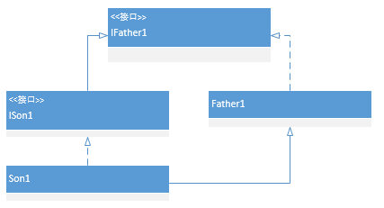

# instanceof关键字
instanceof关键字是在Java类中实现equals方法最常使用的关键字，表示其左边的对象是否是右边类型的实例，这里右边的类型可以扩展到继承、实现结构中，可以是其真实类型，或者真实类型的超类型、超接口类型等。  

instanceof左边必须是对象实例或者null类型，否则无法通过编译。  

instanceof右边必须是左边对象的可转换类型（可强转），否则无法通过编译。  

使用实例：
```java
interface IFather1{}
interface ISon1 extends IFather1{}
class Father1 implements IFather1{}
class Son1 extends Father1 implements ISon1{}
public class InstanceofTest {
    public static void main(String[] args){
        Father1 father1 = new Father1();
        Son1 son1 = new Son1();
        System.out.println(son1 instanceof IFather1);//1-超接口
        System.out.println(son1 instanceof Father1);//2-超类
        System.out.println(son1 instanceof ISon1);//3-当前类
        System.out.println(father1 instanceof IFather1);//4-超接口
        System.out.println(father1 instanceof ISon1);//false
    }
}
```
执行结果为：
```text
true
true
true
true
false
```
如上实例所示：除了最后一个，前四个全部为true，查看类的继承关系如下：
  
  

可以明显看到，Son1类是最终的类，其对象son1可以instanceof上面所以的接口和类（IFather1、ISon1、Father1、Son1），而Father1的实例father1上级只有IFather1接口和本类Father1能instanceof，其余均无法成功。  

这样我们就能理解instanceof的用途了，最后说说其在equals中的作用，我们来看个简单的equals实现（来自java.lang.String类）：
```java
public final class String
    implements java.io.Serializable, Comparable<String>, CharSequence {
    public boolean equals(Object anObject) {
        // 首先判断两个对象是不是同一个，地址相同否
        if (this == anObject) {
            return true;
        }
        // 判断给定的对象是否是String类型，这里instanceof关键字是重写equals方法时经常使用的一个关键字
        // instanseof用于判断右边的类型是否是当前对象的类型或者超类型，超接口类型等
        if (anObject instanceof String) {
            String anotherString = (String)anObject;
            int n = value.length;
            // 校验两个字符串的长度相同否
            if (n == anotherString.value.length) {
                char v1[] = value;
                char v2[] = anotherString.value;
                int i = 0;
                // 循环校验两个字符串中的每个字符是否相同
                while (n-- != 0) {
                    if (v1[i] != v2[i])
                        return false;
                    i++;
                }
                return true;
            }
        }
        return false;
    }
}
```
明显使用到了instanceof关键字，其目的就是为了判断给定的参数对象是否是String类的实例。区别于getClass()方法，后者得到的是当前对象的实际类型，不带继承关系。
```java
public class InstanceofTest {
    public static void main(String[] args){
        Father1 father1 = new Father1();
        Son1 son1 = new Son1();
        System.out.println(son1.getClass());
        System.out.println(father1.getClass());
    }
}
```
结果为：
```text
class Son1
class Father1
```
参考：
- [Java关键字——instanceof](http://www.cnblogs.com/ysocean/p/8486500.html)